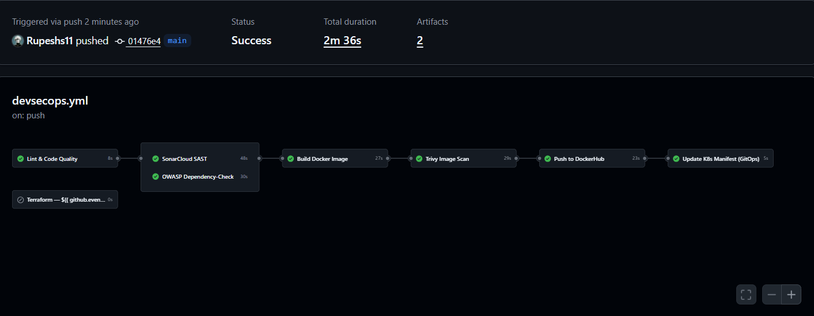

# 💬 Knox Chat — Real-Time Chat Application

A production-ready real-time chat app built with **Flask**, **Socket.IO**, and **MongoDB** — featuring a complete **DevSecOps CI/CD pipeline**, **GitOps** with ArgoCD, **Kubernetes** on AWS EKS, and **Infrastructure as Code** with Terraform.


---

## ✨ Features

- 💬 **Real-time messaging** — Instant message delivery via WebSockets
- 🔐 **User authentication** — Signup / Login with hashed passwords
- 🏠 **Chat rooms** — Create or join any room
- 📜 **Persistent messages** — Chat history stored in MongoDB
- 🌙 **WhatsApp-style dark theme** — Clean, modern UI
- 🐳 **Dockerized** — One-command deployment with Docker Compose
- ☸️ **Kubernetes ready** — Full K8s manifests with Ingress, PV/PVC, ConfigMaps, Secrets
- 🔒 **SSL/HTTPS** — Nginx reverse proxy with Let's Encrypt
- �️ **DevSecOps** — Automated security scanning (SAST, SCA, Container Scanning)
- 🔄 **GitOps** — ArgoCD auto-sync from Git to EKS
- 🏗️ **Infrastructure as Code** — Terraform provisions AWS infrastructure
- 📊 **Monitoring** — Prometheus & Grafana for cluster observability
- 🚀 **CI/CD** — 7-stage DevSecOps pipeline with GitHub Actions

---

## 🛠️ Tech Stack

| Layer                  | Technology                             |
| ---------------------- | -------------------------------------- |
| **Backend**            | Flask, Flask-SocketIO, Gevent          |
| **Database**           | MongoDB                                |
| **Auth**               | Werkzeug (password hashing)            |
| **Frontend**           | HTML, CSS, JavaScript                  |
| **Containerization**   | Docker, Docker Compose                 |
| **Reverse Proxy**      | Nginx (SSL termination)                |
| **Orchestration**      | Kubernetes (Minikube / AWS EKS)        |
| **IaC**                | Terraform (S3 backend, DynamoDB lock)  |
| **CI/CD**              | GitHub Actions                         |
| **SAST**               | SonarCloud                             |
| **SCA**                | OWASP Dependency-Check                 |
| **Container Scanning** | Trivy                                  |
| **GitOps**             | ArgoCD (auto-sync, self-heal)          |
| **Monitoring**         | Prometheus & Grafana                   |
| **Cloud**              | AWS (EKS, VPC, EC2, EBS, S3, DynamoDB) |

---

## 🏗️ Architecture

### DevSecOps & GitOps Architecture


### GitHub Actions Workflow



### ArgoCD GitOps Dashboard


---

## 📸 App Screenshots

|           Login Page           |           Chat Room           |
| :----------------------------: | :---------------------------: |
|  |  |

---

## �️ DevSecOps CI/CD Pipeline

A single GitHub Actions workflow (`devsecops.yml`) with **7 connected stages** and a separate **Terraform** trigger:

```
                        ┌─────────────┐
                   ┌───→│ SonarCloud  │──┐
  ┌──────┐         │    │   (SAST)    │  │    ┌───────┐    ┌─────────┐    ┌──────┐    ┌────────────────┐
  │ Lint │─────────┤    └─────────────┘  ├───→│ Build │───→│ Trivy   │───→│ Push │───→│ Update K8s     │
  └──────┘         │    ┌─────────────┐  │    │ Image │    │ Scan    │    │      │    │ Manifest       │
                   └───→│ OWASP       │──┘    └───────┘    └─────────┘    └──────┘    └────────────────┘
                        │   (SCA)     │                                                       │
                        └─────────────┘                                                       ▼
                                                                                    ArgoCD Auto-Sync
  Manual Trigger ──→ Terraform (plan / apply / destroy)                             to EKS Cluster
```

| Stage              | Tool                   | Purpose                                    |
| ------------------ | ---------------------- | ------------------------------------------ |
| **Lint**           | flake8                 | Python code quality checks                 |
| **SAST**           | SonarCloud             | Source code vulnerability scanning         |
| **SCA**            | OWASP Dependency-Check | Third-party library vulnerability scanning |
| **Build**          | Docker                 | Multi-stage build with non-root user       |
| **Container Scan** | Trivy                  | Docker image vulnerability scanning        |
| **Push**           | DockerHub              | Image registry with SHA-tagged versions    |
| **GitOps**         | ArgoCD                 | Auto-deploy from Git to EKS cluster        |
| **IaC**            | Terraform              | Provision/destroy EKS infrastructure       |

### EC2 Deploy Pipeline

A separate pipeline (`deploy.yml`) for simple EC2 Docker deployments:

```
Manual Trigger ──→ Terraform (creates EC2 with Docker)
Push to main   ──→ Build & Push ──→ Deploy to EC2 (SSH)
```

---

## 🏗️ Infrastructure as Code (Terraform)

Two separate Terraform configurations:

| Config  | Directory              | Infrastructure                                               |
| ------- | ---------------------- | ------------------------------------------------------------ |
| **EKS** | `terraform-devSecOps/` | VPC, Subnets, NAT Gateway, EKS Cluster, Node Groups, EBS CSI |
| **EC2** | `terraform/`           | EC2 Instance, Security Group, Docker (user_data)             |

Both use S3 backend for remote state and DynamoDB for state locking.

---

## 🔄 GitOps with ArgoCD

ArgoCD continuously monitors the `k8s/` directory and auto-syncs changes to EKS:

- **Auto-Sync** — Detects Git changes and deploys automatically
- **Self-Heal** — Reverts any manual cluster changes back to Git
- **Pruning** — Deletes resources removed from Git
- **Rollback** — One-click rollback to any previous version

The CI pipeline updates `k8s/knoxchat-deployment.yml` with the new image tag on every push. ArgoCD detects this change and deploys the new version.

---

## 📊 Monitoring & Observability

Prometheus & Grafana deployed via Helm for full cluster monitoring:

- **Prometheus** — Metrics collection from all pods and nodes
- **Grafana** — Pre-configured dashboards for Kubernetes monitoring
- **Node Exporter** — Host-level metrics (CPU, memory, disk)

|                 Namespace & Nodes                 |              Node Monitoring              |
| :-----------------------------------------------: | :---------------------------------------: |
| .png>) |  |

---

## 🚀 Deployment Guide

### Option 1: Local Development

```bash
git clone https://github.com/Rupeshs11/RealTime-ChatApp-.git
cd RealTime-ChatApp-

python -m venv venv
source venv/bin/activate        # Windows: venv\Scripts\activate
pip install -r requirements.txt

echo "MONGO_URI=mongodb://localhost:27017/knox_chat" > .env
echo "SECRET_KEY=your-secret-key" >> .env

python app.py
```

Open `http://localhost:5000`

---

### Option 2: Docker Compose (Local)

```bash
docker-compose up -d
```

Open `http://localhost:5000`

---

### Option 3: EC2 Production (with SSL)

#### Step 1: Build & Push Docker Image

```bash
docker build -t rupeshs11/knox-chat:latest .
docker login
docker push rupeshs11/knox-chat:latest
```

#### Step 2: Setup EC2 Instance

```bash
# SSH into EC2
ssh -i "your-key.pem" ubuntu@<EC2-IP>

# Install Docker
sudo apt-get update
sudo apt-get install -y docker.io docker-compose-plugin
sudo usermod -aG docker ubuntu
```

#### Step 3: Point Domain to EC2

In your DNS provider, add an **A Record**:

```
<Domain>  →  <EC2-Public-IP>
```

#### Step 4: Get SSL Certificate

```bash
sudo apt-get install -y certbot
sudo certbot certonly --standalone -d <Domain> -d <SubDomain>
```

#### Step 5: Copy Files & Deploy

```bash
scp -i "your-key.pem" docker-compose.prod.yml ubuntu@<EC2-IP>:~/knoxchat/
scp -i "your-key.pem" -r nginx/ ubuntu@<EC2-IP>:~/knoxchat/

ssh -i "your-key.pem" ubuntu@<EC2-IP>
cd ~/knoxchat

echo "MONGO_URI=mongodb://mongodb:27017/knox_chat" > .env
echo "SECRET_KEY=$(python3 -c 'import secrets; print(secrets.token_hex(32))')" >> .env
echo "DB_NAME=knox_chat" >> .env

docker compose -f docker-compose.prod.yml up -d
```

#### Step 6: Verify

```bash
docker compose -f docker-compose.prod.yml ps
docker compose -f docker-compose.prod.yml logs knox-chat
curl -I https://<Domain>
```

Open **https://<Domain>**

---

### Option 4: Kubernetes (Minikube)

#### Step 1: Start Minikube

```bash
minikube start --driver=docker
minikube addons enable ingress
```

#### Step 2: Deploy All Resources

```bash
kubectl apply -f k8s/namespace.yml
kubectl apply -f k8s/configmap.yml
kubectl apply -f k8s/secrets.yml
kubectl apply -f k8s/mongo-pv.yml
kubectl apply -f k8s/mongo-pvc.yml
kubectl apply -f k8s/mongo-deployment.yml
kubectl apply -f k8s/mongo-service.yml
kubectl apply -f k8s/knoxchat-deployment.yml
kubectl apply -f k8s/knoxchat-service.yml
kubectl apply -f k8s/ingress.yml
```

#### Step 3: Access the App

Add to hosts file (`C:\Windows\System32\drivers\etc\hosts`):

```
127.0.0.1 knoxchat.com
```

```bash
minikube tunnel
```

Open **http://knoxchat.com**

---

### Option 5: AWS EKS (Full DevSecOps)

See [DEVSECOPS-GUIDE.md](docs/DEVSECOPS-GUIDE.md) for the complete step-by-step guide.

**Quick steps:**

1. Setup GitHub Secrets (Docker, AWS, SonarCloud)
2. Terraform Apply (creates EKS cluster)
3. Install ArgoCD on EKS
4. Apply ArgoCD Application manifest
5. Install Nginx Ingress Controller
6. Push code → Pipeline runs → ArgoCD deploys

---

## 📁 Project Structure

```
RealTime-ChatApp/
├── app.py                        # Flask app with auth + Socket.IO
├── config.py                     # Environment config loader
├── requirements.txt              # Python dependencies
├── Dockerfile                    # Multi-stage, non-root, health check
├── docker-compose.yml            # Local dev setup
├── docker-compose.prod.yml       # Production setup (Nginx + SSL)
├── sonar-project.properties      # SonarCloud configuration
├── .env.example                  # Environment variables template
│
├── nginx/                        # Nginx reverse proxy config
├── templates/                    # HTML templates (login, signup, chat)
├── static/                       # CSS + JavaScript
│
├── k8s/                          # Kubernetes manifests
│   ├── namespace.yml
│   ├── configmap.yml
│   ├── secrets.yml
│   ├── mongo-storageclass.yml    # EBS StorageClass for EKS
│   ├── mongo-pv.yml / mongo-pvc.yml
│   ├── mongo-deployment.yml / mongo-service.yml
│   ├── knoxchat-deployment.yml / knoxchat-service.yml
│   ├── ingress.yml
│   └── argocd/
│       └── application.yml       # ArgoCD app definition
│
├── terraform/                    # EC2 Infrastructure (Terraform)
│   ├── provider.tf / variables.tf
│   ├── main.tf / outputs.tf
│
├── terraform-devSecOps/          # EKS Infrastructure (Terraform)
│   ├── provider.tf / variables.tf
│   ├── vpc.tf / eks.tf / outputs.tf
│
├── monitoring/                   # Prometheus & Grafana
│   ├── prometheus-values.yml
│   └── setup.md
│
├── docs/                         # Guides & Documentation
│   ├── DEVSECOPS-KNOWLEDGE.md    # Concepts & Interview prep
│   ├── EC2-DEPLOY-GUIDE.md       # EC2 pipeline quick setup
│   └── argocd-setup.md           # ArgoCD installation guide
│
├── .github/workflows/            # CI/CD Pipelines
│   ├── devsecops.yml             # DevSecOps + EKS pipeline
│   └── deploy.yml                # EC2 deploy pipeline
│
├── architecture/                 # Architecture diagrams
├── grafana-stats/                # Grafana monitoring screenshots
└── screenshots/                  # App screenshots
```

---

## ☸️ Kubernetes Resources

| Resource     | Name                  | Purpose                            |
| ------------ | --------------------- | ---------------------------------- |
| Namespace    | `knoxchat`            | Isolates all resources             |
| ConfigMap    | `knoxchat-config`     | MONGO_URI, DB_NAME                 |
| Secret       | `knoxchat-secrets`    | SECRET_KEY (base64 encoded)        |
| StorageClass | `ebs-sc`              | EBS gp3 dynamic provisioning (EKS) |
| PV + PVC     | `mongodb-pv/pvc`      | Persistent MongoDB storage         |
| Deployment   | `mongo-deployment`    | MongoDB pod (1 replica)            |
| Deployment   | `knoxchat-deployment` | App pod with health probes         |
| Service      | `mongo-service`       | Internal MongoDB access            |
| Service      | `knoxchat-service`    | Internal app access (port 5000)    |
| Ingress      | `knoxchat-ingress`    | External access via Nginx          |

---

## 🔐 Environment Variables

| Variable     | Description                          |
| ------------ | ------------------------------------ |
| `MONGO_URI`  | MongoDB connection string            |
| `SECRET_KEY` | Flask session secret key             |
| `DB_NAME`    | Database name (default: `knox_chat`) |

### GitHub Secrets Required

| Secret                  | Pipeline   | Purpose                  |
| ----------------------- | ---------- | ------------------------ |
| `DOCKER_USERNAME`       | Both       | Docker Hub login         |
| `DOCKER_PASSWORD`       | Both       | Docker Hub access token  |
| `SONAR_TOKEN`           | DevSecOps  | SonarCloud SAST analysis |
| `AWS_ACCESS_KEY_ID`     | Both       | Terraform AWS access     |
| `AWS_SECRET_ACCESS_KEY` | Both       | Terraform AWS access     |
| `AWS_REGION`            | Both       | AWS region               |
| `EC2_HOST`              | EC2 Deploy | EC2 public IP            |
| `EC2_SSH_KEY`           | EC2 Deploy | EC2 private key (PEM)    |
| `SECRET_KEY`            | EC2 Deploy | Flask session secret     |

---

## 💡 How to Use

1. Open the app → **Sign up** with a username and password
2. **Login** with your credentials
3. Enter a **room name** (share it with friends!)
4. Start chatting — messages persist across refreshes

---
