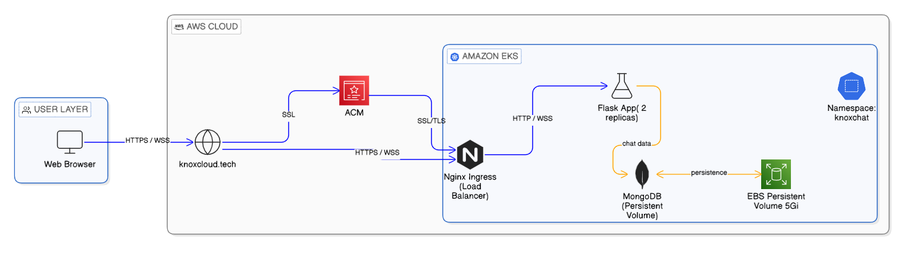
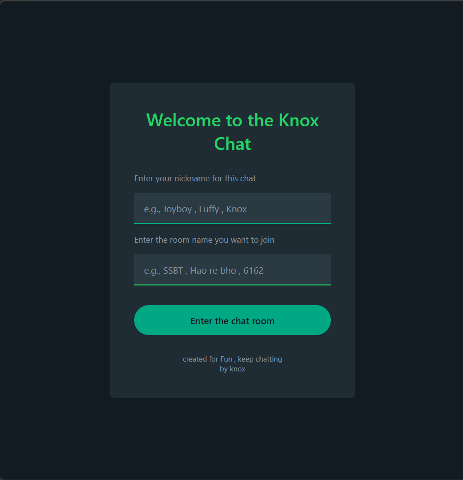
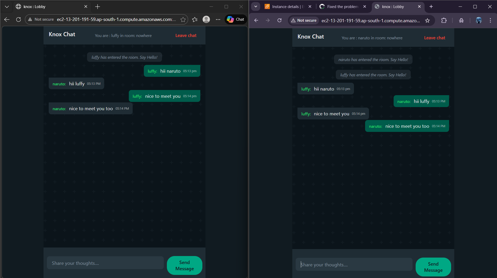
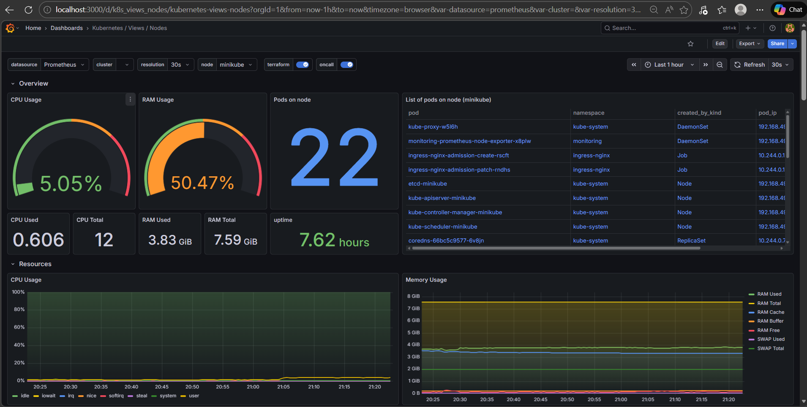

# 💬 Knox Chat — Real-Time Chat Application

A production-ready real-time chat app built with **Flask**, **Socket.IO**, and **MongoDB**, containerized with **Docker**, orchestrated on **Kubernetes (Minikube)**, and deployed to **AWS EC2** with **Nginx SSL** via **CI/CD**.


---

## ✨ Features

- 💬 **Real-time messaging** — Instant message delivery via WebSockets
- 🔐 **User authentication** — Signup / Login with hashed passwords
- 🏠 **Chat rooms** — Create or join any room
- 📜 **Persistent messages** — Chat history stored in MongoDB
- 🌙 **WhatsApp-style dark theme** — Clean, modern UI
- 🐳 **Dockerized** — One-command deployment with Docker Compose
- ☸️ **Kubernetes ready** — Full K8s manifests with Ingress, PV/PVC, ConfigMaps, Secrets
- 🔒 **SSL/HTTPS** — Nginx reverse proxy with Let's Encrypt
- 📊 **Monitoring** — Grafana dashboard for cluster observability
- 🚀 **CI/CD** — Two-stage pipeline (Build → Deploy)

---

## 🛠️ Tech Stack

| Layer                | Technology                    |
| -------------------- | ----------------------------- |
| **Backend**          | Flask, Flask-SocketIO, Gevent |
| **Database**         | MongoDB                       |
| **Auth**             | Werkzeug (password hashing)   |
| **Frontend**         | HTML, CSS, JavaScript         |
| **Containerization** | Docker, Docker Compose        |
| **Reverse Proxy**    | Nginx (SSL termination)       |
| **Orchestration**    | Kubernetes (Minikube)         |
| **Monitoring**       | Grafana                       |
| **CI/CD**            | GitHub Actions (2 pipelines)  |
| **Cloud**            | AWS EC2                       |
| **Domain**           | knoxcloud.tech                |

---

## 🏗️ Architecture

### EKS Deployment



### CI/CD Pipeline


---

## 📸 App Screenshots

|           Login Page           |           Chat Room           |
| :----------------------------: | :---------------------------: |
|  |  |

---

## 🚀 CI/CD Pipeline

Two separate GitHub Actions workflows:

| Pipeline          | Trigger              | What it does                                       |
| ----------------- | -------------------- | -------------------------------------------------- |
| **Build & Push**  | Push to `main`       | Builds Docker image → Pushes to Docker Hub         |
| **Deploy to EC2** | After build succeeds | Copies configs → Pulls image → Restarts containers |

```
  git push ──▶ Pipeline 1: Build Image ──▶ Pipeline 2: Deploy to EC2
                 📦 Docker Hub                 🖥️ docker compose up
```

---

## 🚀 Deployment Guide

### Option 1: Local Development

```bash
git clone https://github.com/Rupeshs11/RealTime-ChatApp-.git
cd RealTime-ChatApp-

python -m venv venv
source venv/bin/activate        # Windows: venv\Scripts\activate
pip install -r requirements.txt

echo "MONGO_URI=mongodb://localhost:27017/knox_chat" > .env
echo "SECRET_KEY=your-secret-key" >> .env

python app.py
```

Open `http://localhost:5000`

---

### Option 2: Docker Compose (Local)

```bash
docker-compose up -d
```

Open `http://localhost:5000`

---

### Option 3: EC2 Production (with SSL)

#### Step 1: Build & Push Docker Image

```bash
docker build -t rupeshs11/knox-chat:latest .
docker login
docker push rupeshs11/knox-chat:latest
```

#### Step 2: Setup EC2 Instance

```bash
# SSH into EC2
ssh -i "your-key.pem" ubuntu@<EC2-IP>

# Install Docker
sudo apt-get update
sudo apt-get install -y docker.io docker-compose-plugin
sudo usermod -aG docker ubuntu
```

#### Step 3: Point Domain to EC2

In your DNS provider, add an **A Record**:

```
<Domain>  →  <EC2-Public-IP>
```

#### Step 4: Get SSL Certificate

```bash
sudo apt-get install -y certbot
sudo certbot certonly --standalone -d <Domain> -d <SubDomain>
```

#### Step 5: Copy Files & Deploy

```bash
# Copy files to EC2
scp -i "your-key.pem" docker-compose.prod.yml ubuntu@<EC2-IP>:~/knoxchat/
scp -i "your-key.pem" -r nginx/ ubuntu@<EC2-IP>:~/knoxchat/

# SSH and deploy
ssh -i "your-key.pem" ubuntu@<EC2-IP>
cd ~/knoxchat

# Create .env
echo "MONGO_URI=mongodb://mongodb:27017/knox_chat" > .env
echo "SECRET_KEY=$(python3 -c 'import secrets; print(secrets.token_hex(32))')" >> .env
echo "DB_NAME=knox_chat" >> .env

# Start everything
docker compose -f docker-compose.prod.yml up -d
```

#### Step 6: Verify

```bash
# Check all containers
docker compose -f docker-compose.prod.yml ps

# Check logs
docker compose -f docker-compose.prod.yml logs knox-chat

# Test SSL
curl -I https://<Domain>
```

Open **https://<Domain>** 🎉

---

### Option 4: Kubernetes (Minikube)

#### Step 1: Start Minikube

```bash
minikube start --driver=docker
minikube addons enable ingress
```

#### Step 2: Create Namespace

```bash
kubectl apply -f k8s/namespace.yml
kubectl get namespaces
```

#### Step 3: Apply ConfigMap & Secrets

```bash
kubectl apply -f k8s/configmap.yml
kubectl apply -f k8s/secrets.yml

kubectl get configmap -n knoxchat
kubectl get secrets -n knoxchat
```

> 💡 **Generate base64 secret:**
>
> ```bash
> python -c "import secrets; print(secrets.token_hex(32))" | base64
> ```

#### Step 4: Deploy MongoDB

```bash
kubectl apply -f k8s/mongo-pv.yml
kubectl apply -f k8s/mongo-pvc.yml
kubectl apply -f k8s/mongo-deployment.yml
kubectl apply -f k8s/mongo-service.yml

kubectl get pods -n knoxchat
```

#### Step 5: Deploy Knox Chat

```bash
kubectl apply -f k8s/knoxchat-deployment.yml
kubectl apply -f k8s/knoxchat-service.yml

kubectl get pods -n knoxchat
kubectl logs -l app=knoxchat -n knoxchat --tail=20
```

#### Step 6: Apply Ingress

```bash
kubectl apply -f k8s/ingress.yml
kubectl get ingress -n knoxchat
```

#### Step 7: Update Hosts & Tunnel

Add to hosts file (`C:\Windows\System32\drivers\etc\hosts`):

```
127.0.0.1 knoxchat.com
```

```bash
# Run in separate terminal
minikube tunnel
```

Open **http://knoxchat.com** 🎉

#### Step 8: Verify Database

```bash
kubectl exec -it $(kubectl get pod -n knoxchat -l app=mongo -o name) -n knoxchat -- mongosh

# Inside mongosh
show dbs
use knox_chat
db.users.find()
db.messages.find()
```

#### Step 9: Test Self-Healing

```bash
kubectl scale deployment knoxchat-deployment --replicas=2 -n knoxchat
kubectl get pods -n knoxchat --watch

# Delete a pod
kubectl delete pod <pod-name> -n knoxchat
# K8s auto-creates a new pod ✅
```

---

## 📊 Monitoring & Observability

Grafana dashboards for cluster monitoring:

|                 Namespace & Nodes                 |              Node Monitoring              |
| :-----------------------------------------------: | :---------------------------------------: |
| .png>) |  |

---

## 📁 Project Structure

```
RealTime-ChatApp/
├── app.py                        # Flask app with auth + Socket.IO
├── config.py                     # Environment config loader
├── requirements.txt              # Python dependencies
├── Dockerfile                    # Container image definition
├── docker-compose.yml            # Local multi-container setup
├── docker-compose.prod.yml       # Production setup (Nginx + SSL)
├── .env.example                  # Environment variables template
│
├── nginx/                        # Nginx reverse proxy config
│   └── nginx.conf                # SSL + WebSocket proxy
│
├── templates/
│   ├── login.html                # Login page
│   ├── signup.html               # Signup page
│   ├── index.html                # Room selection page
│   └── chat.html                 # Chat room page
│
├── static/
│   ├── style.css                 # WhatsApp dark theme
│   └── scripts.js                # Client-side Socket.IO logic
│
├── k8s/                          # Kubernetes manifests
│   ├── namespace.yml
│   ├── configmap.yml
│   ├── secrets.yml
│   ├── mongo-pv.yml
│   ├── mongo-pvc.yml
│   ├── mongo-deployment.yml
│   ├── mongo-service.yml
│   ├── knoxchat-deployment.yml
│   ├── knoxchat-service.yml
│   └── ingress.yml
│
├── .github/workflows/            # CI/CD pipelines
│   ├── docker-build.yml          # Pipeline 1: Build & Push image
│   └── deploy-ec2.yml            # Pipeline 2: Deploy to EC2
│
├── grafana-stats/                # Monitoring screenshots
│
└── screenshots/
    ├── home.png
    └── chat.png
```

---

## ☸️ Kubernetes Resources

| Resource   | Name                  | Purpose                            |
| ---------- | --------------------- | ---------------------------------- |
| Namespace  | `knoxchat`            | Isolates all resources             |
| ConfigMap  | `knoxchat-config`     | MONGO_URI, DB_NAME                 |
| Secret     | `knoxchat-secrets`    | SECRET_KEY (base64 encoded)        |
| PV + PVC   | `mongodb-pv/pvc`      | 5Gi persistent MongoDB storage     |
| Deployment | `mongo-deployment`    | MongoDB pod (1 replica)            |
| Deployment | `knoxchat-deployment` | App pods (2 replicas, 256Mi mem)   |
| Service    | `mongo-service`       | Internal MongoDB access            |
| Service    | `knoxchat-service`    | Internal app access (port 5000)    |
| Ingress    | `knoxchat-ingress`    | External access via `knoxchat.com` |

---

## 🔐 Environment Variables

| Variable     | Description                          |
| ------------ | ------------------------------------ |
| `MONGO_URI`  | MongoDB connection string            |
| `SECRET_KEY` | Flask session secret key             |
| `DB_NAME`    | Database name (default: `knox_chat`) |

#### GitHub Secrets Required

| Secret            | Description                  |
| ----------------- | ---------------------------- |
| `DOCKER_USERNAME` | Docker Hub username          |
| `DOCKER_PASSWORD` | Docker Hub password/token    |
| `EC2_HOST`        | EC2 public IP address        |
| `EC2_SSH_KEY`     | EC2 private key (PEM format) |
| `SECRET_KEY`      | Flask session secret         |

---

## 💡 How to Use

1. Open the app → **Sign up** with a username and password
2. **Login** with your credentials
3. Enter a **room name** (share it with friends!)
4. Start chatting — messages persist across refreshes 🎉

---
